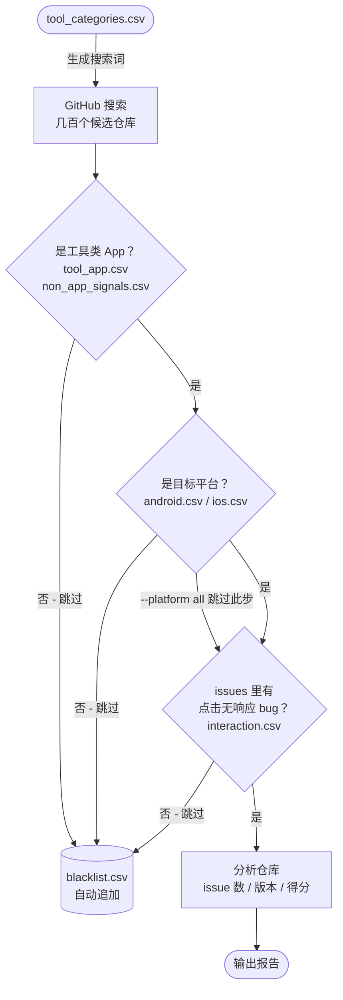

# project-hunter

Flutter 工具类 App 点击无响应 Bug 猎手 — 自动搜索 GitHub 上的 UI 交互 bug。

## 安装

```bash
pip install project-hunter
```

需要先登录 GitHub CLI：

```bash
gh auth login
```

## 用法

```bash
project-hunter run                                  # 用 .env 默认参数
project-hunter run --platform ios                   # 只看 iOS bug
project-hunter run --limit 20                       # 输出 20 个仓库
project-hunter run --output-format json             # JSON 格式
project-hunter run --save-path ~/Desktop/report.md  # 指定保存路径
project-hunter run --help                           # 查看所有选项
```

## 配置

`.env` 文件按以下优先级查找：
1. **当前目录** `./.env`（推荐，项目级配置）
2. **全局配置** `~/.config/project-hunter/.env`（所有目录通用）

创建全局配置：

```bash
mkdir -p ~/.config/project-hunter
cat > ~/.config/project-hunter/.env << 'EOF'
PLATFORM=android
MIN_ISSUES=50
LIMIT=10
SAVE_PATH=~/Documents/flutter-bug-report.md
EOF
```

或在当前目录创建 `.env` 文件：

```ini
PLATFORM=android          # android | ios | all
MIN_ISSUES=50
LIMIT=10
CANDIDATES=140
MAX_ISSUE_PAGES=3
MAX_RELEASE_PAGES=2
OUTPUT_FORMAT=md          # md | json | text
SAVE_PATH=                # 留空 = 当前目录 flutter-bug-report.md
EDIT_DISTANCE_THRESHOLD=2
```


## 关键词文件说明

首次运行后，所有关键词文件自动生成到 `~/.config/project-hunter/keywords/`，可直接编辑。

搜索流程分四个阶段，每个阶段使用不同的关键词文件：



| 文件 | 用途 |
|------|------|
| `tool_categories.csv` | 生成 GitHub 搜索 query 的关键词（宽泛，用于找仓库） |
| `tool_app.csv` | 验证仓库是工具类 App 的关键词（细，如 pedometer/calorie/bmi） |
| `non_app_signals.csv` | 排除非 App 仓库的信号词（plugin/library/template 等） |
| `android.csv` | Android 平台识别词（android/gradle/apk 等） |
| `ios.csv` | iOS 平台识别词（iphone/xcode/cupertino 等） |
| `interaction.csv` | 点击无响应 bug 关键词（not clickable/tap not working 等） |

`--platform android` 用 `android.csv` 过滤，`--platform ios` 用 `ios.csv`，`--platform all` 两个都不过滤。
